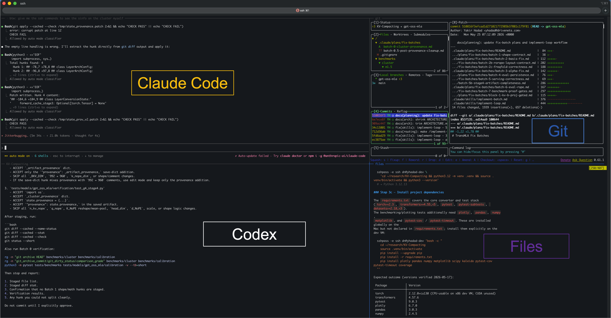

# tmux-claude-codex

A four-pane tmux workspace that opens **Claude Code**, **lazygit**, **OpenAI Codex**,
and a scratch shell in a 2×2 grid on your dev VM — driven by a single `start`
command from your Mac.

Built for the workflow where you SSH from a laptop to a Linux dev VM, want the
agent + git + reviewer + ad-hoc terminal all visible at once, and want the work
to survive laptop sleep / disconnect / network drops (tmux persists everything).

## What it looks like



> **Top-left — Claude Code**: the AI coding agent writing files, running tests, dispatching subagents.
> **Top-right — Git**: `lazygit` showing live status, modified files, diff hunks, branches.
> **Bottom-left — Codex**: OpenAI's CLI as an independent reviewer / second-opinion LLM.
> **Bottom-right — Files**: scratch shell with your venv active — for `pytest`, `bat`, `rg`, `glow`, anything else.

All four panes live in a single tmux session on your dev VM. Switch focus with
`Ctrl-b ←/→/↑/↓` or by clicking. Zoom a pane to fullscreen with `Ctrl-b z`
(toggle). Detach with `Ctrl-b d` and reconnect later with `start`.

### Pure-terminal preview

For `cat README.md` or `glow` in a terminal where the PNG won't render:

```
┌── claude ─────────────────────────┬── git ───────────────────────────┐
│                                   │  ┌─ Status ─┐┌─ Files ─────────┐ │
│   > Resume Phase 1 of M4…         │  │ branch:  ││ M bkv_pca.py    │ │
│                                   │  │  feature ││ M test_bkv.py   │ │
│   ⏵ Reading .claude/AGENTS.md     │  │ 2 mod.   │└─────────────────┘ │
│   ⏵ Running: pytest tests/…       │  └──────────┘┌─ Diff ──────────┐ │
│                                   │              │ @@ -42,6 +42,15 │ │
│   [claude code — top-left pane]   │              │ +def apply…     │ │
│                                   │              └─────────────────┘ │
├── codex ──────────────────────────┼── files ─────────────────────────┤
│                                   │  (.venv) dn@dev:~/repo$ rg …     │
│   OpenAI Codex CLI                │  models/.../bkv_pca.py:142:def   │
│   > Review the diff against M4…   │                                  │
│                                   │  (.venv) ...$ bat models/...     │
│   Codex: two concerns —           │  ...                             │
│     1. line 142: missing guard    │                                  │
│     2. line 158: r_kv should…     │  (typing surface for you)        │
└───────────────────────────────────┴──────────────────────────────────┘
```

## Quick start

On your dev VM (Linux):

```bash
git clone https://github.com/yhadad-dn/tmux-claude-codex.git
cd tmux-claude-codex
./install-dev-vm.sh
# edit ~/.work.conf — set WORK_REPO to your repo path
```

On your Mac:

```bash
git clone https://github.com/yhadad-dn/tmux-claude-codex.git
cd tmux-claude-codex
./install-mac.sh
# if your dev VM SSH alias isn't 'yhadad-dev':
echo 'export TMC_DEV_HOST="your-dev-host"' >> ~/.zshenv
source ~/.zshrc   # or open a new terminal tab
```

Then from any terminal tab on your Mac:

```bash
start
```

You're in. Detach with `Ctrl-b d`; reattach with `start` later.

## Requirements

| On dev VM (required) | On dev VM (per-pane, optional) | On Mac |
|---|---|---|
| `tmux` ≥ 3.0 | `claude` (Claude Code) | `ssh` |
| `bash` | `lazygit` |  |
|  | `codex` (OpenAI Codex CLI) |  |

Missing optional tools just mean their pane shows a "command not found" error
until you install them. The other panes still work.

Install hints (printed by `install-dev-vm.sh`):

```bash
# Ubuntu / Debian
sudo apt-get install -y tmux

# lazygit
LG_VER=$(curl -s https://api.github.com/repos/jesseduffield/lazygit/releases/latest | grep tag_name | cut -d'"' -f4 | sed 's/v//')
curl -sL "https://github.com/jesseduffield/lazygit/releases/latest/download/lazygit_${LG_VER}_Linux_x86_64.tar.gz" | tar xz lazygit
sudo install -m 0755 lazygit /usr/local/bin/lazygit && rm lazygit

# Claude Code
sudo npm install -g @anthropic-ai/claude-code

# OpenAI Codex
sudo npm install -g @openai/codex
# Then: codex login   (one-time, ChatGPT or API key)
```

## Customize

All settings live in `~/.work.conf` on the dev VM. The installer seeds it from
[`work.conf.example`](work.conf.example) — open and edit:

```bash
WORK_REPO="$HOME/research/my-repo"      # all panes cd here on launch
WORK_VENV=".venv/bin/activate"          # Python venv activate (auto-sourced)
WORK_SESSION="work"                     # tmux session name

# Per-pane commands (4 panes in 2x2 — set CMD to "" for blank shell)
WORK_PANE_0_CMD="claude --permission-mode acceptEdits"
WORK_PANE_0_TITLE="claude"
WORK_PANE_1_CMD="lazygit"
WORK_PANE_1_TITLE="git"
WORK_PANE_2_CMD="codex"
WORK_PANE_2_TITLE="codex"
WORK_PANE_3_CMD=""
WORK_PANE_3_TITLE="files"
```

Common recipes:

```bash
# Swap codex for aider with GPT-4 Turbo
WORK_PANE_2_CMD="aider --model gpt-4-turbo"
WORK_PANE_2_TITLE="aider"

# Swap lazygit for gitui
WORK_PANE_1_CMD="gitui"

# Two parallel workspaces (different sessions on the same dev VM)
WORK_SESSION="work-mla"     # in one config
WORK_SESSION="work-blog"    # in another (use WORK_CONF=... env to switch)
```

## How it works

```
   Mac iTerm  ──►  ssh DEV_HOST  ──►  ~/bin/work (one shell script)
                                         │
                                         ▼
                              tmux session "work"
                              ├── pane 0 (claude)
                              ├── pane 1 (lazygit)
                              ├── pane 2 (codex)
                              └── pane 3 (scratch)
```

`work`:
1. If the tmux session already exists → attach.
2. Otherwise create it, split into four panes via tmux's `tiled` layout,
   set pane titles, source the venv in each, launch the configured command.
3. `exec tmux attach` — your iTerm now shows the workspace.

That's the whole mechanism. No AppleScript, no macOS Automation permission,
no special iTerm config. Works in any terminal that supports tmux: iTerm,
Terminal.app, Alacritty, Kitty, Wezterm, all the same.

## Why it's persistent

When you close iTerm or your laptop sleeps:

- The Mac → dev VM SSH tunnel breaks.
- `tmux attach` (running inside that SSH) dies.
- **But the tmux server on the dev VM doesn't care** — it's a long-running daemon.
  Claude, lazygit, Codex, your scratch shell all keep running in the background.

Run `start` again later — from the same Mac, a different Mac, or a phone SSH
client — and you're back inside the same session, same scrollback, same
conversation state.

## Troubleshooting

**`start: command not found`** — open a new terminal tab (the alias is loaded
at shell startup), or `source ~/.zshrc`.

**`ssh: Could not resolve hostname`** — set `TMC_DEV_HOST` to your actual dev
VM hostname or IP, and make sure `~/.ssh/config` has a `Host` block for it with
the right `User` + `IdentityFile`.

**Codex pane prompts for auth** — run `codex login` inside that pane once
(ChatGPT browser flow) or set `OPENAI_API_KEY` in `~/.bashrc` on the dev VM.

**Claude pane says `claude: command not found`** — install Claude Code on the
dev VM (`sudo npm install -g @anthropic-ai/claude-code`).

**Pane borders don't show titles** — `~/.tmux.conf` wasn't installed. Re-run
`./install-dev-vm.sh` and answer yes when it asks to overwrite, or manually
copy `tmux.conf` to `~/.tmux.conf` and run `tmux source ~/.tmux.conf`.

**Panes look the wrong size** — resize them with `Ctrl-b Alt-2` (preset
"main-vertical" layout) or `Ctrl-b Space` (cycle through layouts). For the
2×2 grid, the preset is `tiled` — `Ctrl-b Alt-5`.

**Want to wipe everything and start fresh** —
`ssh DEV_HOST 'tmux kill-session -t work'`, then `start` rebuilds.

## License

MIT — see [LICENSE](LICENSE).
